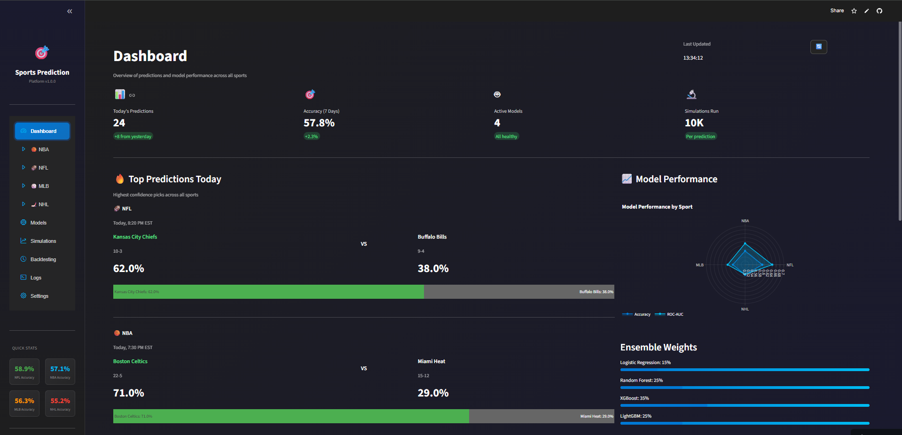
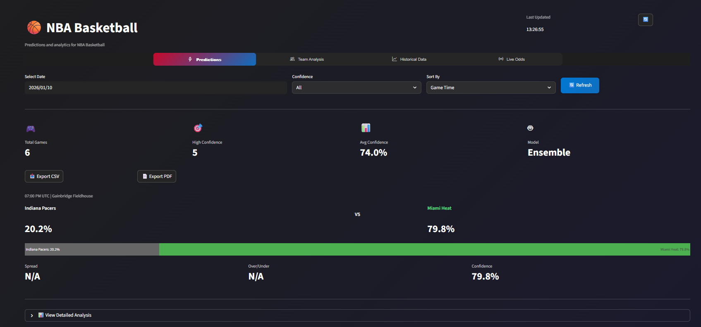

# Sports Prediction Platform

## User Guide

Welcome to the Sports Prediction Platform - your AI-powered companion for smarter sports betting decisions across NBA, NFL, MLB, and NHL.

---

## Getting Started

### Accessing the Platform

Visit the live platform at: **[sports-predictors.streamlit.app](https://sports-predictors.streamlit.app)**

No installation required - simply open the link in any modern web browser (Chrome, Firefox, Safari, Edge).

---

## Platform Overview

### Main Dashboard

The Dashboard gives you a quick snapshot of:
- Today's predictions across all sports
- Overall model accuracy (last 7 days)
- Performance metrics for each sport

### NBA Predictions View

---

## Navigation

Use the sidebar menu on the left to navigate between sections:

| Section | What You'll Find |
|---------|------------------|
| **Dashboard** | Overview of all predictions and accuracy stats |
| **🏀 NBA** | Basketball game predictions |
| **🏈 NFL** | Football game predictions |
| **⚾ MLB** | Baseball game predictions |
| **🏒 NHL** | Hockey game predictions |
| **Models** | Information about prediction models |
| **Simulations** | Monte Carlo simulation results |
| **Backtesting** | Historical accuracy data |

---

## How to View Predictions

### Step 1: Select a Sport
Click on any sport from the sidebar (NBA, NFL, MLB, or NHL).

### Step 2: Choose a Date
Use the date picker at the top of the page to select the date you want predictions for.

### Step 3: Review Predictions
Each game card shows:
- **Teams playing** (Home vs Away)
- **Win probability** for each team
- **Confidence score** - how sure the model is about the prediction
- **Game time** and venue

---

## Understanding the Predictions

### Win Probability
This is the model's calculated chance of each team winning, shown as a percentage (0-100%).

**Example:** If Team A shows 65% and Team B shows 35%, the model predicts Team A is more likely to win.

### Confidence Score
This tells you how confident the model is in its prediction:

| Confidence | Meaning |
|------------|---------|
| **High (70%+)** | Strong prediction - the model sees clear factors favoring one team |
| **Medium (55-70%)** | Moderate confidence - some uncertainty exists |
| **Low (<55%)** | Toss-up game - either team could win |

### Color Coding
- **Green** - High confidence, strong prediction
- **Yellow/Orange** - Medium confidence
- **Red** - Lower confidence or close matchup

---

## Sports Coverage

### 🏀 NBA (Basketball)
- Daily game predictions
- Player impact analysis (how star players affect outcomes)
- Team form (recent win/loss record)
- Home court advantage factored in

### 🏈 NFL (Football)
- Weekly matchup predictions
- Quarterback performance ratings
- Team momentum analysis

### ⚾ MLB (Baseball)
- Daily game predictions
- Starting pitcher impact
- Venue and weather factors

### 🏒 NHL (Hockey)
- Daily game predictions
- Goalie performance tracking
- Home ice advantage

---

## Sidebar Quick Stats

The sidebar displays real-time accuracy statistics:
- **NFL Accuracy** - Current prediction accuracy for football
- **NBA Accuracy** - Current prediction accuracy for basketball
- **MLB Accuracy** - Current prediction accuracy for baseball
- **NHL Accuracy** - Current prediction accuracy for hockey

### Backend Status
At the bottom of the sidebar, you'll see:
- **🟢 Online** - System is working normally
- **🔴 Offline** - System is temporarily unavailable

---

## Exporting Predictions

You can download predictions for your records:

1. Navigate to the sport predictions page
2. Look for export buttons (CSV or PDF)
3. Click to download

**CSV** - Opens in Excel or Google Sheets for further analysis
**PDF** - Formatted report for printing or sharing

---

## Tips for Best Results

1. **Check predictions close to game time** - Predictions are updated regularly with the latest data

2. **Consider confidence scores** - Higher confidence predictions tend to be more reliable

3. **Use as one input** - Combine predictions with your own research for best results

4. **Track accuracy** - Use the Models and Backtesting pages to see how well the system performs

5. **Multiple sports** - The platform covers 4 major leagues, so diversify your analysis

---

## Frequently Asked Questions

### How often are predictions updated?
Predictions are refreshed every time you load the page. For the most current data, simply refresh your browser.

### Why are some games not showing?
Games only appear for dates when scheduled. If no games are scheduled for that date, the page will indicate this.

### What data goes into the predictions?
The models analyze:
- Historical team performance
- Recent form (last 5-10 games)
- Home/away factors
- Key player availability
- Head-to-head records

### How accurate are the predictions?
Accuracy varies by sport and is displayed on the sidebar. Historical accuracy can be viewed in the Backtesting section.

### Can I trust these predictions for betting?
This platform is a decision-support tool. Always:
- Bet responsibly
- Never bet more than you can afford to lose
- Use predictions as one factor in your decision-making

---

## Need Help?

If you encounter any issues or have questions:
- Report bugs: [GitHub Issues](https://github.com/OsamaASidd/Sports-Frontend/issues)
- Backend API docs: [API Documentation](https://sportspredictor-backend-app-6e075ffc23f5.herokuapp.com/docs)

---

## System Requirements

- Any modern web browser (Chrome, Firefox, Safari, Edge)
- Stable internet connection
- Desktop or mobile device

---

*Sports Prediction Platform - Making smarter predictions with AI*
